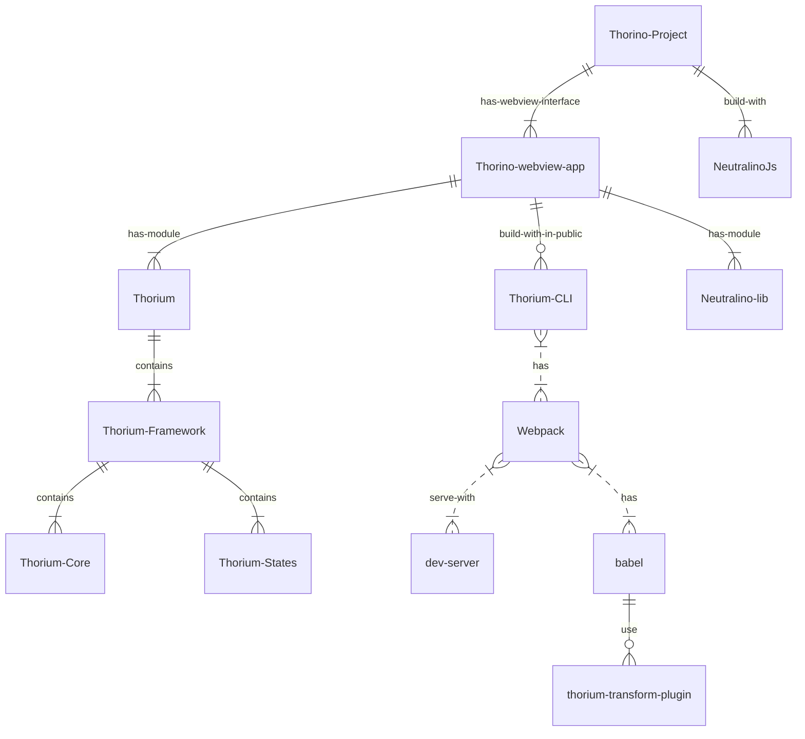

# Introduction

Ce projet est une application de bureau développée avec NeutralinoJS. L'application utilise un cadre personnalisé que j'ai inclus dans le projet. J'ai également mis en place un environnement permettant de compiler du JSX/TSX. L'application est un projet vide, vous pouvez l'étendre comme vous le souhaitez.

# Avantages de l'utilisation de NeutralinoJS

NeutralinoJS est un framework léger et rapide, ce qui le rend idéal pour le développement d'applications de bureau. Vous pouvez rapidement créer des interfaces utilisateur complexes et interactives sans avoir à vous soucier des performances.

NeutralinoJS est également un framework multiplateforme, ce qui signifie que vous pouvez créer des applications de bureau qui peuvent être exécutées sur Windows, macOS et Linux. Cela vous permet de développer une seule application qui peut être utilisée par un large éventail d'utilisateurs.

Enfin, NeutralinoJS est basé sur les technologies Web, ce qui signifie que vous pouvez utiliser des technologies Web telles que HTML, CSS et JavaScript pour créer vos interfaces utilisateur. Cela vous permet de tirer parti des nombreuses ressources disponibles pour le développement Web, telles que les bibliothèques et les frameworks.

# Environnement de compilation JSX/TSX

J'ai utilisé un compilateur JSX/TSX pour convertir le code JSX/TSX en code JavaScript. Cela me permet d'utiliser des fonctionnalités telles que l'état et les composants dans mon code JSX/TSX.

J'ai également utilisé un compilateur TypeScript pour convertir le code TypeScript en code JavaScript. Cela me permet d'utiliser des fonctionnalités telles que les types et les classes dans mon code TypeScript.

J'ai enfin utilisé un compilateur Webpack pour empaqueter mon code et mes ressources dans un seul fichier exécutable. Cela me permet de créer une application de bureau autonome qui peut être exécutée sans avoir besoin d'un environnement d'exécution.

<aside>
⚠️ Prérequis

* Installer Neutralino globalement

```shell
npm install -g @neutralinojs/neu
```

</aside>

# Installation , Développement , Production

### Installer les modules NodeJS

```shell
npm install
```

### Mettre à jour Neutralino

```shell
neu update
```


### Lancer Neutralino

```shell
neu run
```

### Construire l'application pour les différentes plateformes

```shell
neu build
```



<aside>
⚠️ Instructions supplémentaires pour Windows

* Vérifiez que la version de `binaryVersion` contenue dans `neutralino.config.json` est égale ou supérieure à 4.13.0. Cette version garantit le bon fonctionnement dans les environnements Windows 10 et 11.

* Vérifiez que le runtime webview2 est installé. Disponible à l'adresse : https://developer.microsoft.com/en-us/microsoft-edge/webview2/.

* Il est possible que la commande `neu` soit bloquée par le `set-ExecutionPolicy` de Windows. Dans ce cas, exécutez la commande suivante avec les privilèges d'administrateur dans l'invite de commande pour résoudre ce problème : `Set-ExecutionPolicy -ExecutionPolicy RemoteSigned -Scope LocalMachine` et appuyez sur `T` pour accepter pour toutes les exécutions.

* Vous risquez d'obtenir un écran blanc. La raison en est que l'accès à localhost à partir d'un contexte UWP est désactivé par défaut. Exécutez la commande suivante avec les privilèges d'administrateur dans l'invite de commande pour résoudre ce problème : `CheckNetIsolation.exe LoopbackExempt -a -n="Microsoft.Win32WebViewHost_cw5n1h2txyewy"`

</aside>

# Conclusion

Dans ce projet, j'ai utilisé NeutralinoJS pour développer une application de bureau. J'ai également mis en place un environnement permettant de compiler du JSX/TSX. J'ai trouvé que NeutralinoJS est un framework puissant et facile à utiliser qui est idéal pour le développement d'applications de bureau.